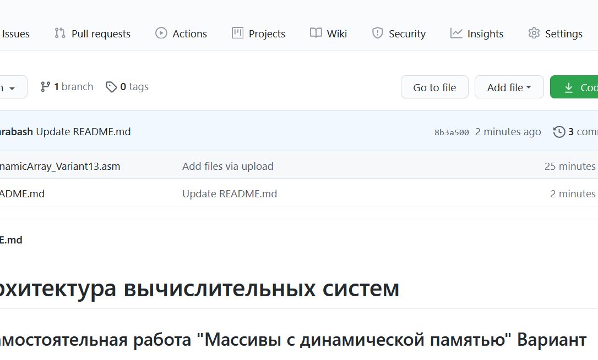

# Архитектура вычислительных систем 
## (Самостоятельная работа "Массивы с динамической памятью" Вариант 13)
### Разработать программу, использующую динамическое выделение памяти под массив, которая:
1. вводит одномерный массив A[N], 
1. формирует из элементов массива A новый массив B по правилам, указанным в таблице, и 
1. выводит его.

### Разбить решение задачи на функции следующим образом: 
1. Ввод и вывод массивов оформить как процедуры.
1. Выполнение задания по варианту оформить как процедуру.
1. Указанные процедуры могут использовать данные напрямую (имитация процедур без параметров).

## Отчет
**Использовал отладчик OllyDbg**

